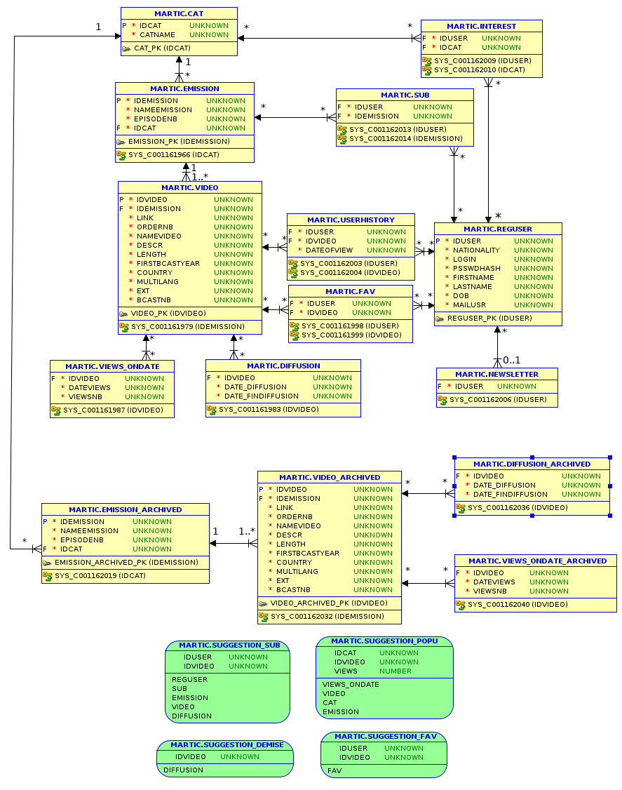

Dans le cadre de l’unité d’enseignement Bases de Données 2 en L3 d’Informa-
tique à l’Université de Strasbourg, nous devons réaliser une base de données
d’un site de replay de vidéos, permettant aux utilisateurs de mettre en favoris
des vidéos, de consulter leur historique, d’avoir des suggestions de vidéos selon
la popularité de ces dernières, de l’intérêt que l’utilisateur est susceptible de leur
porter etc...
Dans mon cas j’ai décidé de réaliser le projet sous Oracle.

Ce projet se présente sous plusieurs fichier :

- sujet.pdf : sujet du projet, voir pages 2 et 3 pour les requêtes demandées
- create.sql : fichier faisant la création des tables, vues, séquences et triggers d’auto-incréments
- fill.sql : fichier permettant de remplir la base de données ORACLE avec des données permettant de tester le bon fonctionnement du système
- destroy.sql : fichier permettant de détruire la base de données (tables, vues etc.)
- request.sql: fichier regroupant toutes les requêtes demandées dans le sujet
- rapport.pdf : rapport de projet

Le schéma UML de la base de données :
